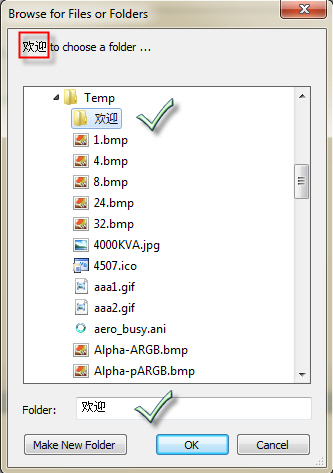



## Unicode BrowseForFolder

### Description

Browse for folder or file in Unicode version.

Tested on XP/Vista/Win7.
 
### More Info
 

             |
---                |---
**Submitted On**   |2011-05-19 23:50:02
**By**             |[Zhu JinYong](https://github.com/Planet-Source-Code/PSCIndex/blob/master/ByAuthor/zhu-jinyong.md)
**Level**          |Beginner
**User Rating**    |4.6 (23 globes from 5 users)
**Compatibility**  |VB 6\.0
**Category**       |[VB function enhancement](https://github.com/Planet-Source-Code/PSCIndex/blob/master/ByCategory/vb-function-enhancement__1-25.md)
**World**          |[Visual Basic](https://github.com/Planet-Source-Code/PSCIndex/blob/master/ByWorld/visual-basic.md)
**Archive File**   |[Unicode\_Br2204575192011\.zip](https://github.com/Planet-Source-Code/zhu-jinyong-unicode-browseforfolder__1-73919/archive/master.zip)

